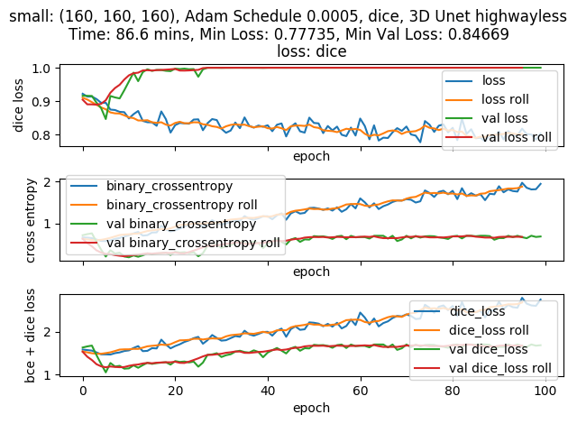
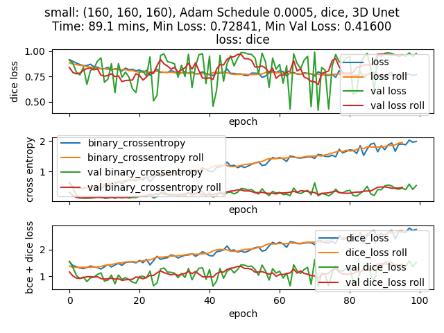
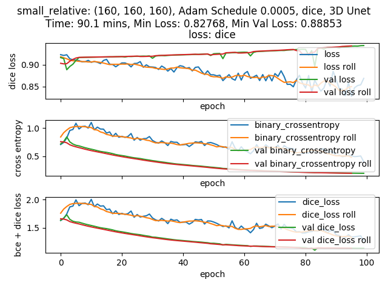
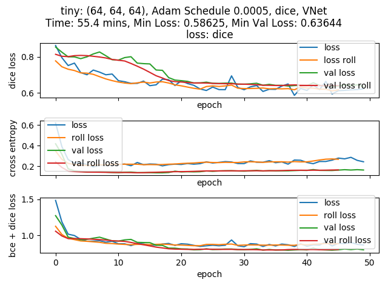
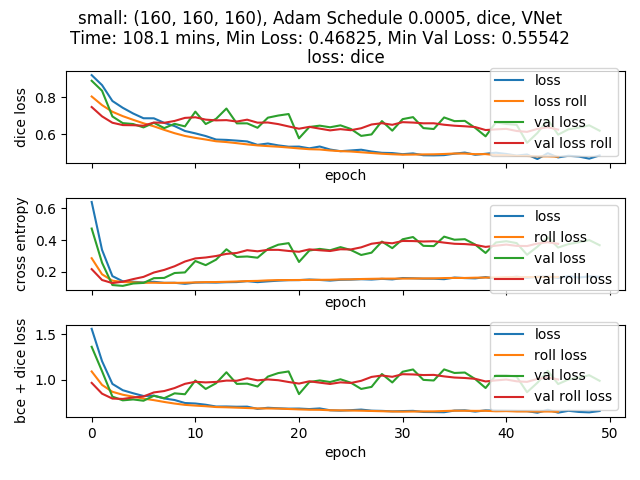
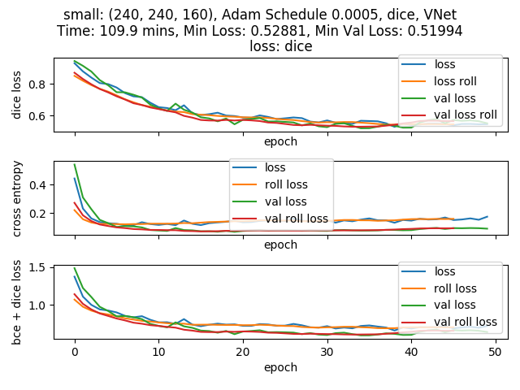
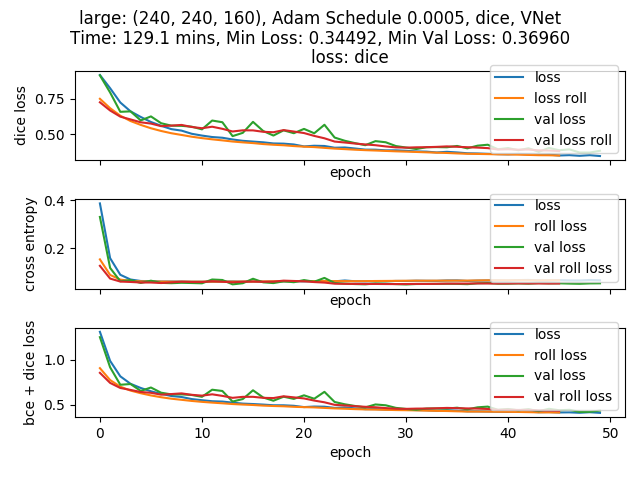
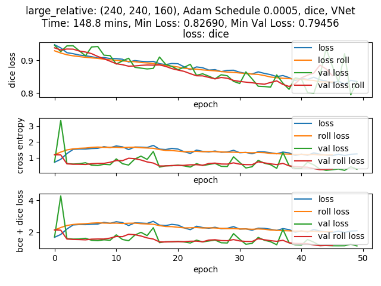

# Automated Tissue Segmentation from High-Resolution 3D Steady-State MRI with Deep Learning

Albert Ugwudike, Joe Arrowsmith, Joonsu Gha, Kamal Shah, Lapo Rastrelli, Olivia Gallupova, Pietro Vitiello

---

### 2D Models Implemented

- [x] Vanilla UNet 
- [x] Attention UNet
- <del> [x] Multi-res UNet </del>
- [x] R2_UNet
- [x] R2_Attention UNet
- [ ] 100-layer Tiramisu
- [ ] DeepLabv3+ 

### 3D Models Implemented

- [x] 3D UNet
- [x] Relative 3D UNet
- [x] Slice 3D UNet
- [x] VNet
- [x] Relative VNet
- [x] Slice VNet

---

## Results

### Baseline Comparision of 3D Methods

| Model                     | Input Shape       | Loss  | Val Loss | Duration / Min  |
|---------------------------|-------------------|-------|----------|-----------------|
| Small Highwayless 3D UNet | (160,160,160)     | 0.777 | 0.847    | 86.6            |
| Small 3D UNet             | (160,160,160)     | 0.728 | 0.416    | 89.1            |
| Small Relative 3D UNet    | (160,160,160),(3) | 0.828 | 0.889    | 90.1            |
| Small VNet                | (160,160,160)     | 0.371 | 0.342    | 89.5            |

#### Small 3D Unet Highwayless (160,160,160)

Training Loss | Training Progress
:------------:|:---------------------------:
 | 


<br />

#### Small 3D Unet (160,160,160)

Training Loss | Training Progress
:------------:|:---------------------------:
 | 


<br />

#### Small Relative 3D Unet (160,160,160),(3)

Training Loss | Training Progress
:------------:|:---------------------------:
 | 


<br />

#### Small VNet (160,160,160)

Training Loss | Training Progress
:------------:|:---------------------------:
 | 


---

### Comparison of VNet Methods

|      Model     |      Input Shape  |        Loss   |      Val Loss  |     Roll Loss | Roll Val Loss |Duration / Min|
|:--------------:|:-----------------:|:-------------:|:--------------:|:-------------:|:-------------:|:------------:|
|      Tiny      |     (64,64,64)    | 0.627 ± 0.066 |  0.684 ± 0.078 | 0.652 ± 0.071 | 0.686 ± 0.077 |  61.5 ± 5.32 |
|      Tiny      |    (160,160,160)  | 0.773 ± 0.01  |  0.779 ± 0.019 | 0.778 ± 0.007 | 0.787 ± 0.016 | 101.8 ± 2.52 |
|      Small     |    (160,160,160)  | 0.648 ± 0.156 |  0.676 ± 0.106 | 0.656 ± 0.152 | 0.698 ± 0.076 | 110.1 ± 4.64 |
| Small Relative | (160,160,160),(3) | 0.653 ± 0.168 |  0.639 ± 0.176 | 0.659 ± 0.167 | 0.644 ± 0.172 | 104.6 ± 9.43 |
|      Slice     |     (160,160,5)   | 0.546 ± 0.019 |  0.845 ± 0.054 | 0.559 ± 0.020 | 0.860 ± 0.072 |  68.6 ± 9.68 |
|      Small     |    (240,240,160)  | 0.577 ± 0.153 |  0.657 ± 0.151 | 0.583 ± 0.151 | 0.666 ± 0.149 | 109.7 ± 0.37 |
|      Large     |    (240,240,160)  | 0.505 ± 0.262 |  0.554 ± 0.254 | 0.508 ± 0.262 | 0.574 ± 0.243 | 129.2 ± 0.50 |
| Large Relative | (240,240,160),(3) | 0.709 ± 0.103 |  0.880 ± 0.078 | 0.725 ± 0.094 | 0.913 ± 0.081 | 148.6 ± 0.20 |

```
Baseline results from training VNet models for 50 epochs, exploring how quick models converge. Models optimized for dice loss using a scheduled Adam optimizier. Start learning rate: $5e^{-5}$, Schedule drop: $0.9$, Schedule drop epoch frequency: $3$. Z-Score normalisation and replacement of outliers with mean pixel was applied to inputs. Subsamples were selected normally distributed from the centre. Github commit: cb39158

Optimal training session is choosen for each visulation.
```

#### Tiny VNet (64,64,64)

Training Loss | Training Progress
:------------:|:---------------------------:
 | 

#### Tiny VNet (160,160,160)

Training Loss | Training Progress
:------------:|:---------------------------:
 | 

#### Small VNet (160,160,160)

Training Loss | Training Progress
:------------:|:---------------------------:
 | 

#### Small Relative VNet (160,160,160),(3)

Training Loss | Training Progress
:------------:|:---------------------------:
 | 

#### Small Slice VNet (160,160,5)

Training Loss | Training Progress
:------------:|:---------------------------:
 | 

#### Small VNet (240,240,160)

Training Loss | Training Progress
:------------:|:---------------------------:
 | 

#### Large VNet (240,240,160)

Training Loss | Training Progress
:------------:|:---------------------------:
 | 

#### Large Relative VNet (240,240,160),(3)

Training Loss | Training Progress
:------------:|:---------------------------:
 | 

---

### Useful Code Snippets

``` Bash
Run 3D Train

python Segmentation/model/vnet_train.py
```

``` Bash
Unit-Testing and Unit-Test Converage

python -m pytest --cov-report term-missing:skip-covered --cov=Segmentation && coverage html && open ./htmlcov.index.html
```
